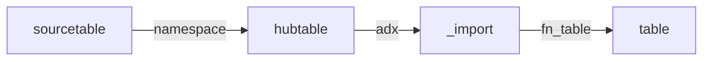

# 🐻‍❄️
Sentinel to ADX migration.

## Standard Tables

1. [AzureActivity.kql](AzureActivity.kql)
2. [AADManagedIdentitySignInLogs.kql](AADManagedIdentitySignInLogs.kql)

Log Analytics Workspaces allow Export of standard table to Eventhub Namespace, one Eventhub per table, 10 hubs max per namespace. An export rule is created in log analytics workspace per table to the destined hub. Then, in ADX Web-UI (KWE), use the Get-Data UI wizard to create a data connection from the eventhub to a new or existing table and mapping. 

In this case the following tables land as a single column (records - of dynamic datatype) and the table gets transformed by a kql function to automatically expand into individual columns for analytics on a derived target table. This transformation occurs automatically per batches pulled from the hub on the intervals of the batching ingestion policy. 

Any redacted columns from the source table in log analytics workspace are controled by the export service of log analytics workspace. In ADX we basically store all the fields as they come the export service, without any additional transformations. 

If the kql function fails to processes batches, the failures can be seen using system view `.show ingestion failures`. For which case, the function can be altered as needed, but the data would still be writen in "raw" format to the `_import` table incase it needs to be read.

## Reference
- [Integrate Azure Data Explorer (ADX) for long-term log retention](https://github.com/Azure/Azure-Sentinel/tree/master/Tools/AzureDataExplorer)
